<div align="center">

<!-- Animated Header -->


<!-- Dynamic Typing Animation -->


<!-- Profile Views Counter -->


<!-- Animated Divider -->


</div>

---

## 🚀 Professional Overview

<div align="center">

```ascii
╔══════════════════════════════════════════════════════════════╗
║  🎯 Enterprise Technology Consultant & Solutions Architect   ║
║  📊 Specialized in AI-Driven Data Intelligence Systems      ║  
║  🏗️  Full-Stack Development with Enterprise-Grade Security   ║
║  💹 Financial Technology & Algorithmic Trading Systems      ║
╚══════════════════════════════════════════════════════════════╝
```

</div>


As a technology consultant specializing in enterprise-grade solutions, I architect comprehensive systems that transform complex business challenges into scalable, intelligent automation platforms. My expertise encompasses the entire technology stack, enabling Fortune 500 organizations to leverage cutting-edge AI and data analytics for measurable competitive advantages.

---

## 💼 Core Technology Arsenal

<div align="center">

### 🔥 Programming Languages


### ⚡ Frameworks & Libraries  


### 🗄️ Databases & Storage


### ☁️ Cloud & DevOps


### 🤖 AI & Machine Learning


</div>

---

## 📈 GitHub Analytics & Performance

<div align="center">


<!-- Activity Graph -->


</div>

---

## 🎯 Solution Architecture & Capabilities

<table>
<tr>
<td width="50%" valign="top">

### 🧠 Intelligent Data Systems
```python
class DataIntelligence:
    def __init__(self):
        self.capabilities = [
            "🕷️ Advanced Web Scraping (50K+ records/day)",
            "🤖 AI-Powered Data Processing", 
            "📊 Real-time Analytics Pipelines",
            "🔄 ETL/ELT Automation Systems",
            "🎯 Predictive Analytics Models"
        ]
        self.scale = "Enterprise Grade"
        self.uptime = "99.9%"
```

</td>
<td width="50%" valign="top">

### 💹 Financial Technology
```python  
class FinTechSolutions:
    def __init__(self):
        self.systems = [
            "📈 Algorithmic Trading Platforms",
            "🎲 Risk Management Systems", 
            "💰 Portfolio Optimization AI",
            "📊 Market Data Processing",
            "🔮 Quantitative Analysis Tools"
        ]
        self.performance = "Institutional Grade"
        self.compliance = "Regulatory Approved"
```

</td>
</tr>
<tr>
<td width="50%" valign="top">

### 🤖 AI & Machine Learning
```python
class AIArchitecture:
    def __init__(self):
        self.solutions = [
            "🧠 RAG Systems (Vector Databases)",
            "💬 Conversational AI Platforms", 
            "🔍 Semantic Search Engines",
            "📝 Document Intelligence",
            "🎯 Custom LLM Fine-tuning"
        ]
        self.accuracy = "95%+"
        self.response_time = "<200ms"
```

</td>
<td width="50%" valign="top">

### 🌐 Full-Stack Development
```python
class WebSolutions:
    def __init__(self):
        self.expertise = [
            "⚡ High-Performance APIs",
            "🎨 Modern UI/UX Design",
            "🔒 Enterprise Security",
            "📱 Responsive Applications", 
            "☁️ Cloud-Native Architecture"
        ]
        self.scalability = "Multi-Million Users"
        self.deployment = "Global CDN"
```

</td>
</tr>
</table>

---

## 🏆 Enterprise Impact & Recognition

<div align="center">


</div>

### 📊 Quantified Business Results

```mermaid
graph LR
    A[🎯 Client Challenges] --> B[🔧 Custom Solutions]
    B --> C[📈 Measurable Results]
    
    C --> D[💰 95% Cost Reduction]
    C --> E[⚡ 10x Performance Increase] 
    C --> F[🎯 99.9% Accuracy Rate]
    C --> G[🚀 500% ROI Average]
```

<div align="center">



</div>

**Enterprise Achievements:**
- 🏢 **Fortune 500 Consulting:** Multi-million dollar data transformation projects
- 🤖 **AI Implementation:** Production systems serving 100K+ concurrent users  
- 💹 **Trading Systems:** Live algorithms managing 8-figure portfolios
- 📊 **Data Processing:** Real-time systems handling 10TB+ daily throughput
- ⚡ **Performance Optimization:** 1000x speed improvements in critical systems

---

## 🎨 Featured Project Showcase

<div align="center">

### 🚀 Enterprise RAG Intelligence Platform


*Advanced conversational AI with enterprise knowledge management*

---

### 📊 Intelligent Data Acquisition System  


*High-scale web scraping with real-time notifications*

---

### 💹 Algorithmic Trading Framework


*ML-powered financial analytics with risk management*

</div>

---

## 📞 Professional Network & Consulting

<div align="center">

### 🤝 Connect for Enterprise Solutions

[](https://linkedin.com/in/touhidul-islam)
[](https://www.upwork.com/freelancers/touhid)
[](https://touhid.dev)
[](mailto:touhid.contact@gmail.com)


### 💡 Currently Available for Select Enterprise Engagements

```ascii
┌─────────────────────────────────────────────────┐
│  🎯 AI & Data Strategy Consulting              │
│  🏗️  Enterprise System Architecture           │  
│  🚀 Digital Transformation Projects           │
│  💹 Financial Technology Development          │
└─────────────────────────────────────────────────┘
```

</div>

---

<div align="center">

## 💭 Philosophy

*"Technology transcends mere code—it's about architecting intelligent solutions that create measurable business value and sustainable competitive advantages in our data-driven economy."*


<!-- Footer Wave -->


</div>
